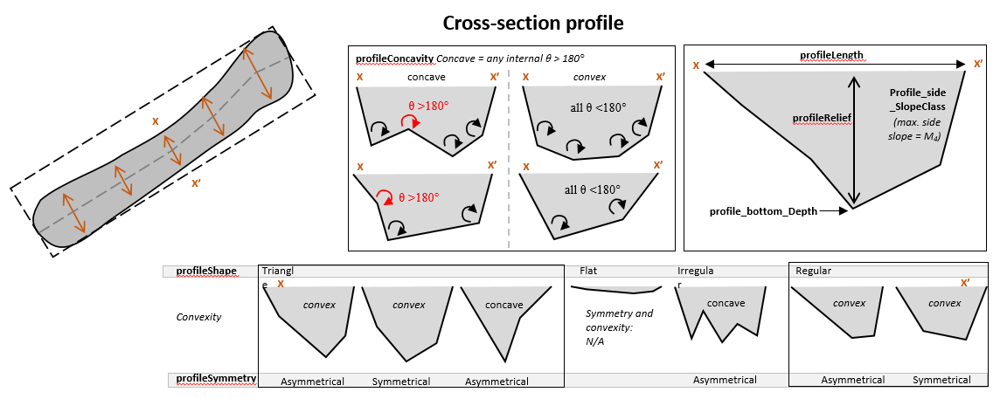

Add Profile Attributes Low
--------------------------

This tool add a number of profile attributes to the input feature class.
This tool requires the **LengthWidthRatio** attribute to be calculated first using the Add Shape Attributes Low Tool.

For each bathymetric low feature, if its area is larger than a user-defined threshold, five cross-section profiles perpendicular to the orientation of the feature, with an equal distance-interval are generated; otherwise only one cross-section profile perpendicular to the orientation of the feature is generated.

The following attributes are calculated to describe the cross-section profile(s). Note that a complex cross-section is simplified by identifying and linking knick points. The start and end points of a cross-section profile are always selected as knick points.

1. **profieShape**: Describe the shape of the cross-section profile

    * *Flat*: when the profile or simplified profile has only two knick points (start and end)
    * *Triangle*: when the profile or simplified profile has three knick points
    * *Irregular*: when the profile or simplified profile has more than three knick points and the profile is concave in the profileConcavity attribute
    * *Regular*: when the profile or simplified profile has more than three knick points and the profile is convex in the profileConcavity attribute

2. **profileSymmetry**: Describe the symmetry of the cross-section profile

    * *Symmetric*: when profile's skewness is < 0.2
    * *Asymmetic*: when profile's skewness is >= 0.2
    * *NA*: when the profileShape attribute is Flat

3. **profileConcavity**: Describe the concavity of the cross-section profile

    * *Concave*: when the polygon formed by the knick points of the profile or simplified profile has an angle > 180°
    * *Convex*: when the polygon formed by the knick points of the profile or simplified profile does not have any angles > 180°
    * *NA*: when the proileShape attribute is Flat

4. **profile_bottom_SlopeClass**: Describe the category of the slope-gradient of the bottom of the profile or simplified profile, which is calculated as the mean of the slope-gradients of all profile's non-side segments

    * *Flat*: slope-gradient < 5
    * *Gentle*: slope-gradient 5-10
    * *Moderate*: slope-gradient 10-30
    * *Steep*: slope-gradient > 30
    * *no* bottom: when the profileShape attribute is Triangle
    * *NA*: when the profileShape attribute is Flat

5. **profile_side_SlopeClass**: Describe the category of the slope-gradient of side of the profile or simplified profile, which is calculated as the weighted average of the slope-gradients of the two profile's side segments. The weights are the inverse distances (segment lengths).

    * *Flat*: slope gradient < 5
    * *Gentle*: slope gradient 5-10
    * *Moderate*: slope gradient 10-30
    * *Steep*: slope gradient > 30
    * *NA*: when the profileShape attribute is Flat

6. **profile_bottom_Depth**: Describe the water depth of the bottom of the profile or simplified profile, which is calculated at the deepest of the profile's knick points 

7. **profileRelief**: Describe the topographic relief of the profile or simplified profile, which is calculated as the depth range between the shallowest and the deepest of the profile's knick points

8. **profileLength**: Describe the length of the profile or simplified profile, which is calculated as the distance between the start point and end point of the profile

