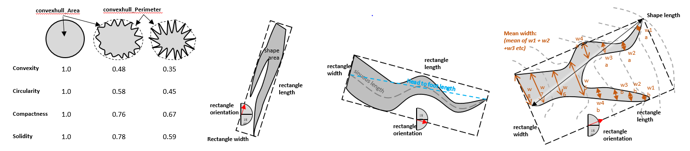

Add Shape Attributes High
-------------------------

This tool add a number of shape attributes to the input bathymetric high feature class as described in :download:`Wirth, M.A. Shape Analysis & Measurement <auxiliary/wirth10.pdf>`.

The following attributes are calculated to describe the polygon shape of each bathymetric high feature.

1. *head_foot_length*: the euclidean distance between two ends of the feature polygon, along the long axis
2. *sinuous_length*: the sinuous distance between two ends of the feature polygon, along the long axis
3. *mean_width*: the mean width of the feature polygon, calculated from a number of cross-sections perpendicular to the orientation of the feature polygon
4. *Compactness*: Describe how compact the feature polygon is. More complex polygon shape has a lower compactness. It is calculated by equation :eq:`compactness-high`, where *A* is the area of the polygon, *P* is the perimeter of the polygon

   .. math::
     :label: compactness-high
   
     \frac{4 * \pi * A}{P^2}

5. *Sinuosity*: Describe the sinuosity of the feature polygon. Larger the value more sinuous the feature polygon is. It is calculated by equation :eq:`sinuosity-high`

   .. math::
     :label: sinuosity-high
   
     \frac{sinuous\_length}{head\_foot\_length}

6. *LengthWidthRatio*: Describe the length to width ratio of the feature polygon. Larger the value more elongate the feature polygon is. It is calculated by equation :eq:`length-width-ratio-high`

   .. math::
     :label: length-width-ratio-high
  
     \frac{sinuous\_length}{mean\_width}

7. *Circularity*: Describe how close the feature polygon is to a circle. Larger the value closer to a circle the feature polygon is. It is calculated by equation :eq:`circularity-high-2`, where *Pc* is the perimeter of the convex hull polygon that bounds the feature polygon.

   .. math::
     :label: circularity-high-2
  
     \frac{4 * \pi * A}{Pc^2}

8. *Convexity*: Describe the convexity of the feature polygon. More complex polygon has a lower convexity. It is calculated by equation :eq:`convexity-high`

   .. math::
     :label: convexity-high
  
     \frac{Pc}{P}

9. *Solidity*: Describe the solidity of the feature polygon. More complex polygon has a lower solidity.  It is calculated by equation :eq:`solidity-high`

   .. math::
     :label: solidity-high
  
     \frac{A}{Ac}

In addition, a number of intermediate attributes are also calculated:

1. *rectangle_Length*: the length of the bounding rectangle (by width) that bounds the feature polygon
2. *rectangle_Width*: the width of the bounding rectangle (by width) that bounds the feature polygon
3. *rectangle_Orientation*: the orientation of the bounding rectangle (by width) that bounds the feature polygon
4. *convexhull_Area*: the area of the convex hull that bounds the feature polygon
5. *convexhull_Perimeter*: the perimeter of the convex hull that bounds the feature polygon

.. code-block:: python
   :linenos:

   from arcpy import env
   from arcpy.sa import *
   arcpy.CheckOutExtension("Spatial")
   
   # import the python toolbox
   arcpy.ImportToolbox("C:/semi_automation_tools/User_Guide/Tools/AddAttributes.pyt")
   
   env.workspace = 'C:/semi_automation_tools/testSampleCode/Gifford.gdb'
   env.overwriteOutput = True
   
   # specify input and output parameters of the tool
   inFeat = 'test_BH'
   inBathy = 'gifford_bathy'
   tempFolder = 'C:/semi_automation_tools/temp4'
   
   # execute the tool
   arcpy.AddAttributes.Add_Shape_Attributes_High_Tool(inFeat,inBathy,tempFolder)
