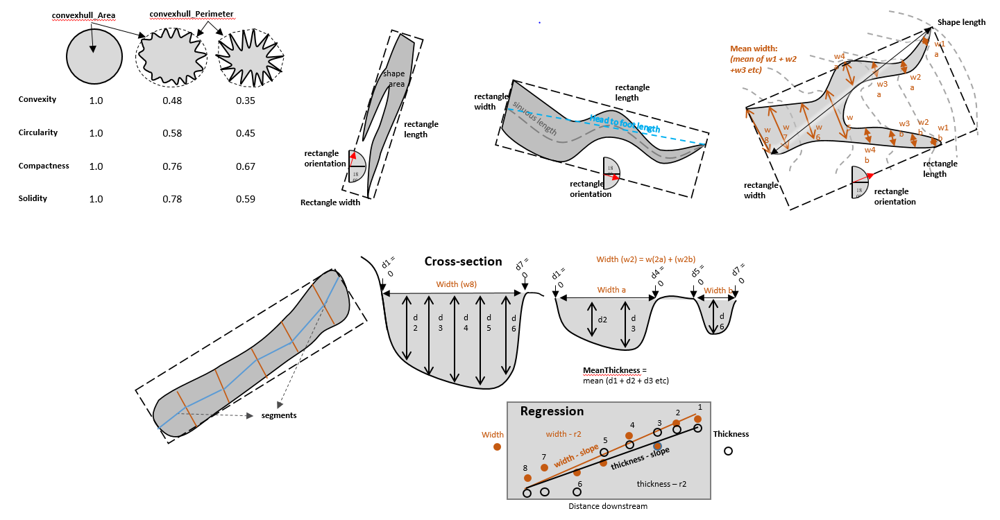

Add Shape Attributes Low
------------------------

This tool add a number of shape attributes to the input bathymetric low feature class as described in :download:`Wirth, M.A. Shape Analysis & Measurement <auxiliary/wirth10.pdf>`.

The following attributes are calculated to describe the polygon shape of each bathymetric low feature.

1. *head_foot_length*: the euclidean distance between the head and the foot of the feature polygon, along the long axis
2. *sinuous_length*: the sinuous distance between two ends of the feature polygon, along the long axis
3. *mean_width*: the mean width of the feature polygon, calculated from a number of cross-sections perpendicular to the orientation of the feature polygon
4. *mean_thickness*: the mean thickness of the feature polygon, calculated from a number of cross-sections perpendicular to the orientation of the feature polygon. The thickness of a cross-section is calculated as the depth difference between the deeper end of the cross-section and the deepest point on the bottom of the cross-section
5. *mean_width_thickness_ratio*: the mean width to thickness ratio of the feature polygon, calculated from a number of cross-sections perpendicular to the orientation of the feature polygon. The width to thickness ratio of each cross-section is calculated as width/thickness
6. *std_width_thickness_ratio*: the standard deviation of width to thickness ratio of the feature polygon, calculated from a number of cross-sections perpendicular to the orientation of the feature polygon. The width to thickness ratio of each cross-section is calculated as width/thickness
7. *mean_segment_slope*: the mean slope gradient of thalweg segments of the feature polygon. The thalweg segments are the line segments linking the deepest points of the cross-sections perpendicular to the orientation of the feature
8. *width_distance_slope*: the slope of the linear regression line between two variables: the widths of the cross-sections and the distances of the cross-sections to the head of the feature polygon
9. *width_distance_correlation*: the Pearson correlation coefficient between two variables: the widths of the cross-sections and the distances of the cross-sections to the head of the feature polygon
10. *thick_distance_slope*: the slope of the linear regression line between two variables: the thicknesses of the cross-sections and the distances of the cross-sections to the head of the feature polygon
11. *thick_distance_correlation*: the Pearson correlation coefficient between two variables: the thicknesses of the cross-sections and the distances of the cross-sections to the head of the feature polygon
12. *Compactness*: Describe how compact the feature polygon is. More complex polygon shape has a lower compactness. It is calculated by equation :eq:`compactness-low`, where *A* is the area of the polygon, *P* is the perimeter of the polygon

   .. math::
     :label: compactness-low
   
     \frac{4 * \pi * A}{P^2}

13. *Sinuosity*: Describe the sinuosity of the feature polygon. Larger the value more sinuous the feature polygon is. It is calculated by equation :eq:`sinuosity-low`

   .. math::
     :label: sinuosity-low
   
     \frac{sinuous\_length}{head\_foot\_length}

14. *LenghWidthRatio*: Describe the length to width ratio of the feature polygon. Larger the value more elongate the feature polygon is. It is calculated by equation :eq:`length-width-ratio-low`

   .. math::
     :label: length-width-ratio-low
  
     \frac{sinuous\_length}{mean\_width}

15. *Circularity*: Describe how close the feature polygon is to a circle. Larger the value closer to a circle the feature polygon is. It is calculated by equation :eq:`circularity-low-2`, where *Pc* is the perimeter of the convex hull polygon that bounds the feature polygon.

   .. math::
     :label: circularity-low-2
  
     \frac{4 * \pi * A}{Pc^2}

16. *Convexity*: Describe the convexity of the feature polygon. More complex polygon has a lower convexity. It is calculated by equation :eq:`convexity-low`

   .. math::
     :label: convexity-low
  
     \frac{Pc}{P}

17. *Solidity*: Describe the solidity of the feature polygon. More complex polygon has a lower solidity.  It is calculated by equation :eq:`solidity-low`

   .. math::
     :label: solidity-low
  
     \frac{A}{Ac}

In addition, a number of intermediate attributes are also calculated:

1. *rectangle_Length*: the length of the bounding rectangle (by width) that bounds the feature polygon
2. *rectangle_Width*: the width of the bounding rectangle (by width) that bounds the feature polygon
3. *rectangle_Orientation*: the orientation of the bounding rectangle (by width) that bounds the feature polygon
4. *convexhull_Area*: the area of the convex hull that bounds the feature polygon
5. *convexhull_Perimeter*: the perimeter of the convex hull that bounds the feature polygon

.. code-block:: python
   :linenos:

   from arcpy import env
   from arcpy.sa import *
   arcpy.CheckOutExtension("Spatial")
   
   # import the python toolbox
   arcpy.ImportToolbox("C:/semi_automation_tools/User_Guide/Tools/AddAttributes.pyt")
   
   env.workspace = 'C:/semi_automation_tools/testSampleCode/Gifford.gdb'
   env.overwriteOutput = True
   
   # specify input and output parameters of the tool
   inFeat = 'test_BL'
   inBathy = 'gifford_bathy'
   tempFolder = 'C:/semi_automation_tools/temp4'
   headFeat = 'test_BL_head'
   footFeat = 'test_BL_foot'
   
   # execute the tool
   arcpy.AddAttributes.Add_Shape_Attributes_Low_Tool(inFeat,inBathy,tempFolder,headFeat,footFeat)
