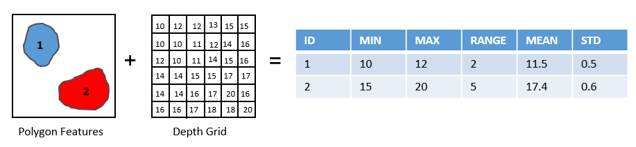

Add Topographic Attributes High
-------------------------------

This tool add a number of topographic attributes to the input bathymetric high feature class.

The following attributes are calculated from the bathymetry and slope-gradient rasters to describe the topographic properties of each bathymetric high feature.

1. *minDepth*: the minimum water depth within the feature polygon
2. *maxDepth*: the maximum water depth within the feature polygon
3. *depthRange*: the difference in water depth within the feature polygon, which is calculated by equation :eq:`depth-range`
4. *meanDepth*: the mean water depth within the feature polygon
5. *stdDepth*: the standard deviation of the water depths within the feature polygon
6. *minGradient*: the minimum slope-gradient within the feature polygon
7. *maxGradient*: the maximum slope-gradient within the feature polygon
8. *gradientRange*: the difference in slope-gradient within the feature polygon, which is calculated by equation :eq:`gradient-range`
9. *meanGradient*: the mean slope-gradient within the feature polygon
10. *stdGradient*: the standard deviation of the slope-gradients within the feature polygon

