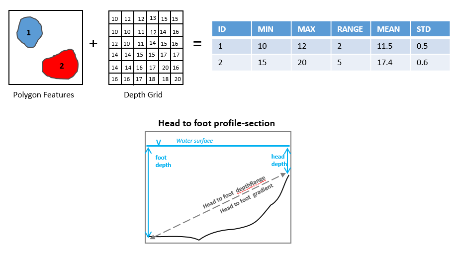

Add Topographic Attributes Low
------------------------------

This tool add a number of topographic attributes to the input bathymetric low feature class.

The following attributes are calculated from the bathymetry and slope-gradient rasters to describe the topographic properties of each bathymetric high feature.

1. *headDepth*: water depth at the head point of the feature polygon, along the long axis
2. *footDepth*: water depth at the foot point of the feature polygon, along the long axis
3. *head_foot_depthRange*: the difference in water depth between the head point and the foot point of the feature polygon
4. *head_foot_gradient*: the slope-gradient between the head point and the foot point of the feature polygon, which is calculated by equation :eq:`slope-gradient`
5. *minDepth*: the minimum water depth within the feature polygon
6. *maxDepth*: the maximum water depth within the feature polygon
7. *depthRange*: the difference in water depth within the feature polygon, which is calculated by equation :eq:`depth-range`
8. *meanDepth*: the mean water depth within the feature polygon
9. *stdDepth*: the standard deviation of the water depths within the feature polygon
10. *minGradient*: the minimum slope-gradient within the feature polygon
11. *maxGradient*: the maximum slope-gradient within the feature polygon
12. *gradientRange*: the difference in slope-gradient within the feature polygon, which is calculated by equation :eq:`gradient-range`
13. *meanGradient*: the mean slope-gradient within the feature polygon
14. *stdGradient*: the standard deviation of the slope-gradients within the feature polygon

