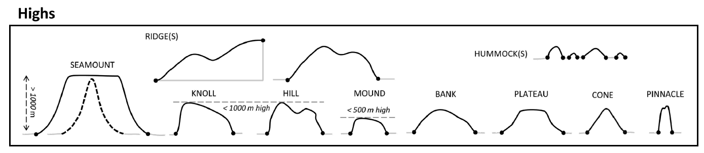

Classify Bathymetric High Features
----------------------------------

This tool classifies each bathymetric high feature into one of these 10 morphology feature types:

.. hlist::
   :columns: 2

   * Seamount
   * Knoll
   * Hill
   * Cone
   * Mound
   * Plateau
   * Bank
   * Pinnacle
   * Ridge
   * Hummock

Based on the attibutes calculated using **AddAttributes** Toolset.

The classification scheme is based on this publication :cite:`dove_2020_4075248`.

The classification rules largely follow the :cite:`dove_2020_4075248` scheme, with some modifications. They are as follows:

.. code-block:: python
    :linenos:

    if LengthWidthRatio >= ridge_lwRationT:
        feature_type = "Ridge"
    elif depthRange >= 1000:  # metres
        feature_type = "Seamount"
    elif depthRange >= meanWidth:
        feature_type = "Pinnacle"
    elif (profileShape == "Triangle") and ((profileSideSlope == "Moderate") or (profileSideSlope == "Steep")) and (polygonCircularity >= cone_circularityT):
        feature_type = "Cone"
    elif (profileSlope == "Flat") and (minDepth <= bank_minDepth) and (polygonArea >= bank_areaT):
        feature_type = "Bank"
    elif (profileSlope == "Flat") and (polygonArea > plateau_areaT) and ((one_profileSideSlope == "Moderate") or (one_profileSideSlope == "Steep")):
        feature_type = "Plateau"
    elif depthRange >= 500:  # metres
        if profileShape == "Regular":
            feature_type = "Knoll"
        else:
           feature_type = "Hill"
    elif (depthRange <= hummock_depthRangeT) and (polygonArea <= hummock_areaT):
        feature_type = "Hummock"
    else:
        feature_type = "Mound"

Where:

* **LengthWidthRatio** is the *LengthWidthRatio* attribute
* **depthRange** is the *depthRange* attribute
* **meanWidth** is the *mean_width* attribute
* **profileSlope** is evaluated either from the *profile_top_SlopeClass* attribute when the *profileShape* is not *Triangle* or from the *profile_side_SlopeClass* attribute when the *profileShape* is *Triangle* or from the combination of both attributes
* **profileSideSlope** is the *profile_side_SlopeClass* attribute
* **minDepth** is the *minDepth* attribute
* **profileShape** is the *profileShape* attribute
* **polygonCircularity** is the *Cirularity* attribute
* **polygonArea** is the *Shape_Area* attribute.

Note that a range of default values have been set for those threshold values. 

.. code-block:: python
   :linenos:

   from arcpy import env
   from arcpy.sa import *
   arcpy.CheckOutExtension("Spatial")
   
   # import the python toolbox
   arcpy.ImportToolbox("C:/semi_automation_tools/User_Guide/Tools/ClassificationFeature.pyt")
   
   env.workspace = 'C:/semi_automation_tools/testSampleCode/Gifford.gdb'
   env.overwriteOutput = True
   
   # specify input and output parameters of the tool
   inFeat = 'test_BH'
   ridge_LWR = 5.0
   bank_MD = 200.0 # in meters
   bank_areaT = 1.0 # in km2
   plateau_areaT = 100.0 # in km2
   hummock_DR = 10.0 # in meters
   hummock_areaT = 1000.0 # in m2
   cone_C = 0.75
   
   ### execute the tool with default parameters
   ##arcpy.ClassifyFeatures.Classify_Bathymetric_High_Features_Tool(inFeat)
   # execute the tool with user-defined parameters
   arcpy.ClassifyFeatures.Classify_Bathymetric_High_Features_Tool(inFeat,ridge_LWR,bank_MD,bank_areaT,plateau_areaT,hummock_DR,hummock_areaT,cone_C)
