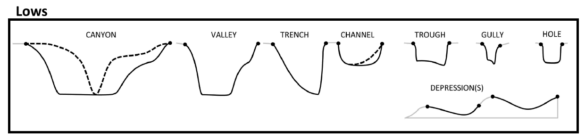

Classify Bathymetric Low Features
---------------------------------

This tool classifies each bathymetric low feature into one of these 8 morphology feature types:

.. hlist::
   :columns: 2

   * Hole
   * Depression
   * Trench
   * Trough
   * Canyon
   * Valley
   * Channel
   * Gully

Based on the attibutes calculated using **AddAttributes** Toolset.

The classification scheme is based on this publication :cite:`dove_2020_4075248`.

The classification rules largely follow the :cite:`dove_2020_4075248` scheme, with some modifications. They are as follows:

.. code-block:: python
    :linenos:

    if lwRatio >= lwRatioT:
        if headDepth >= headDepthT:
            if (profileSymmetry == asymmetric) and ((profileSlope == "Steep") or (profileSlope == "Moderate")):
                feature_type = "Trench"
            else:
                feature_type = "Trough"
        elif (meanSegmentSlope >= meanSegmentSlopeT1) and ((profileSide == "Steep") or (profileSide == "Moderate")):
            feature_type = "Gully"
        elif (hfDepthRange >= hfDepthRangeT) and (meanSegmentSlope >= meanSegmentSlopeT2):
            fetature_type = "Canyon"
        else:
            feature_type = "Valley"  # or Channel; TODO; confirm logic
    elif (polygonCircularity >= circularityT) and (profileSide is "Steep"):
        feature_type = "Hole"
    else:
        feature_type = "Depression"

Where:

* **lwRatio** is the *LengthWidthRatio* attribute
* **headDepth** is the *headDepth* attribute
* **profileSymmtry** is the *profileSymmetry* attribute
* **profileSlope** is evaluated either from the *profile_bottom_SlopeClass* attribute when the *profileShape* is not *Triangle* or from the *profile_side_SlopeClass* attribute when the *profileShape* is *Triangle* or from the combination of both attributes
* **hfDepthRange** is the *head_foot_depthRange* attribute
* **meanSegmentSlope** is the *mean_segment_slope* attribute
* **profileSide** is the *profile_side_SlopeClass* attribute
* **polygonCircularity** is the *Cirularity* attribute

Note that a range of default values have been set for those threshold values.
Also note that *meanSegmentSlopeT2* must be smaller than *meanSegmentSlopeT1*.

.. code-block:: python
   :linenos:

   from arcpy import env
   from arcpy.sa import *
   arcpy.CheckOutExtension("Spatial")
   
   # import the python toolbox
   arcpy.ImportToolbox("C:/semi_automation_tools/User_Guide/Tools/ClassificationFeature.pyt")
   
   env.workspace = 'C:/semi_automation_tools/testSampleCode/Gifford.gdb'
   env.overwriteOutput = True
   
   # specify input and output parameters of the tool
   inFeat = 'test_BL'
   LWR = 8.0
   hfDR = 600.0 # in meters
   hD = 4000.0 # in meters
   shapeC = 0.5
   segmentS1 = 7.0 # degree
   segmentS2 = 2.0 # degree
   
   ### execute the tool with default parameters
   ##arcpy.ClassifyFeatures.Classify_Bathymetric_Low_Features_Tool(inFeat)
   # execute the tool with user-defined parameters
   arcpy.ClassifyFeatures.Classify_Bathymetric_Low_Features_Tool(inFeat,LWR,hD,segmentS1,hfDR,segmentS2,shapeC)
