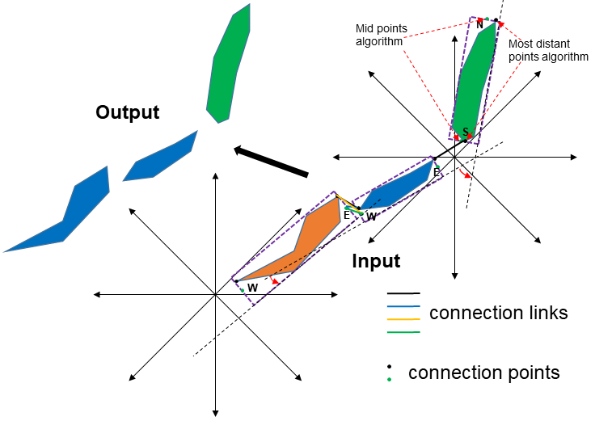

Connect Nearby Linear Features
------------------------------

A linear bathymetric high or low feature (e.g., ridge or valley/channel) is sometimes broken into multiple smaller and disconnected features due to several possible reasons: 

* dificiency in the bathymetric data
* deficiency in the mapping method
* natural local processes such as ersosion and desposition

Ideally, these disconnected features should be merged to form a single integrated linear feature to facilitate the subsequent attribute generation and classification.
This tool is used to connect (or merge) two or multiple bathymetric high or low features that satitifying a number of conditions based on distance and orientation.
The first step of the process is to identify the potential connection points for each feature.
There are three algorithms available for this step. 

1. The *Mid points to Minimum Bounding Rectangle* algorithm identifies the connection points as the middle points on the correponding sides of the minimum bounding rectangle. Based on the orientation of the feature, these sides could either be *North and South* sides or *East and West* sides
2. The *Most distant points on feature* algorithm identifies the connection points as the intercepted locations between the feature and the corresponding sides of the minimum bounding rectangle
3. The *Mid points and Most distant points* algorithm identifies two sets of connection points

    * The *Mid points* algorithm
    * The *Most distant points* algorithm

The next step is to generate connection links from these connection points. These links are created from each feature to each of its nearby features that are within the distance threshold.
In the following step, the tool selects a subset of these links based on certain criteria. These criteria are determined by the *distance threshold*, the *angle threshold*, the *distance weight* and the *angle weight*.
In this step, there are six link directions to consider when determining which nearby features (if any) should be connected:

.. hlist::
   :columns: 2

   * south-to-north
   * west-to-north
   * south-to-east
   * west-to-east
   * south-to-west
   * east-to-north

For example, for the *west-to-north* link direction considers whether a feature orientated (from the east) to the west with a nearby feature orientated from the north (to the south) should be connected.
Finally, the nearby features identified from this subset of suitable connection links are merged. 

When there are a large number of features in the dataset, the *Area Threshold* and *Length to Width Ratio Threshold* parameters can be used to select a subset of features for the above connection process.

Note that the output *featureclasses* from the **Merge Connected Features Tool** can be used as the input to this tool. 

.. code-block:: python
   :linenos:

   from arcpy import env
   from arcpy.sa import *
   arcpy.CheckOutExtension("Spatial")
   
   # import the python toolbox
   arcpy.ImportToolbox("C:/semi_automation_tools/User_Guide/accessory_tools/Accessory_Tools.pyt")
   
   env.workspace = 'C:/semi_automation_tools/testSampleCode/Point_Cloates.gdb'
   env.overwriteOutput = True
   
   # specify input and output parameters of the tool
   inFeat = 'pc_tpi10_075std_45m2'
   distT = '200 Meters'
   angleT = 20
   distW = 2
   angleW = 1
   conOption = 'Mid points on Minimum Bounding Rectangle'
   outFeat = 'pc_tpi10_075std_45m2_connected'
   tempFolder = 'C:/semi_automation_tools/temp'
   
   # execute the tool with user-defined parameters
   arcpy.AccessoryTools.Connect_Nearby_Linear_Features_Tool(inFeat,distT,angleT,distW,angleW,conOption,'#','#',outFeat,tempFolder)
