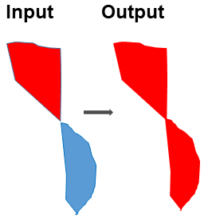

Merge Connected Features
------------------------

Two or multiple polygons that are connected through a shared point may be considered as a single feature.
This tool is used to merge (or dissolve) these connected polygons into larger polygons.
The tool identifies those features that are connected through shared points and then generates a new *featureclass* after merging these connected features.

The new featureclass can then be used as input to the **Connect Nearby Linear Features Tool** and the **Connect Nearby Linear HF Features Tool** for further connection of linear nearby (but not spatial connected) features.
The new *featureclass* can also be directly used as input to the **AddAttributes** toolset and the **ClassificationFeatures** toolset to generate attributes and assign feature types.

Note that this tool can be used for both bathymetric high and bathymetric low features.

