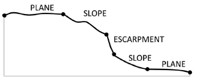

Morphological Surface Tool Bathymetry
-------------------------------------

This tool classifies an area into three **surface** categories: *Plane*, *Slope* and *Escarpment* from a bathymetric data.
The three **surface** categories are classified based on the values of slope gradient.

The *surface* classification method is based on the seabed morphology scheme published in [Dove2020]_.

.. [Dove2020] Dove, D., Nanson, R., Bjarnadóttir, L., Guinan, J., Gafeira, J., Post, A., Dolan, M.; Stewart, H.; Arosio, R, Scott, G.. (2020). A two-part seabed geomorphology classification scheme (v.2); Part 1: morphology features glossary. Zenodo. http://doi.org/10.5281/zenodo.4075248 

The followings are the key steps of this tool.

1. Calculate slope gradient raster from the input bathymetry raster.
2. Reclassify the slope gradient raster into a three-class raster based on the following criteria:

    * If slope gradient < 2, class = 1 (*Plane*)
    * If 2 < slope gradient < 10, class = 2 (*Slope*)
    * If slope gradient > 10, class = 3 (*Escarpment*) 

3. Apply Majority FIlter to the reclassified raster a number of time using the *number_neighbors* option of *Eight* and the *majority_definition* option of *Half*. The number of time is defined by the *nuMF* input parameter.
4. Convert the filterred raster into polygons.
5. Select the polygons with areas smaller than the *Area threshold* parameter  and merge them into their largest neighbours to obtain the final **surface** features as output.

