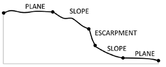

Morphological Surface Tool Slope
--------------------------------

This tool classifies an area into three **surface** categories: *Plane*, *Slope* and *Escarpment* from a slope gradient grid.
The three **surface** categories are classified based on the values of slope gradient.
Note that the slope gradient grid can be generated from software other than ArcGIS using a neighbourhood size othe than 3 by 3.

The *surface* classification method is based on the seabed morphology scheme published in :cite:`dove_2020_4075248`.

The followings are the key steps of this tool.

1. Reclassify the slope gradient raster into a three-class raster based on the following criteria:

    * If slope gradient < 2, class = 1 (*Plane*)
    * If 2 < slope gradient < 10, class = 2 (*Slope*)
    * If slope gradient > 10, class = 3 (*Escarpment*) 

2. Apply Majority FIlter to the reclassified raster a number of time using the *number_neighbors* option of *Eight* and the *majority_definition* option of *Half*. The number of time is defined by the *nuMF* input parameter.
3. Convert the filterred raster into polygons.
4. Select the polygons with areas smaller than the *Area Threshold* parameter  and merge them into their largest neighbours to obtain the final **surface** features as output.

.. code-block:: python
   :linenos:

   import arcpy
   from arcpy import env
   from arcpy.sa import *
   arcpy.CheckOutExtension("Spatial")
   
   # import the python toolbox
   arcpy.ImportToolbox("C:/semi_automation_tools/User_Guide/Tools/Surface.pyt")
   
   env.workspace = 'C:/semi_automation_tools/testSampleCode/Gifford.gdb'
   env.overwriteOutput = True
   
   # specify input and output parameters of the tool
   inSlope = 'gifford_slope'
   outFeat = 'gifford_surface1'
   areaT = '1 SquareKilometers'
   numMajorityFilter = 3
   tempWorkspace = 'C:/Users/u56061/Documents/ArcGIS/Projects/UserGuide/UserGuide.gdb'
   
   
   # execute the tool with user-defined parameters
   arcpy.Surface.SurfaceToolSlope(inSlope,outFeat,areaT,numMajorityFilter,tempWorkspace)
