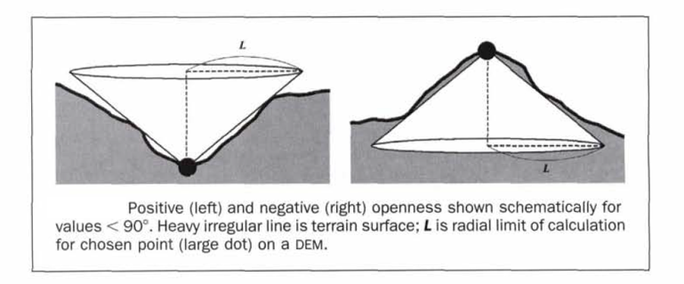

Openness Tool Bathymetric Low
-----------------------------

This tool maps bathymetric low features from a bathymetric data using an openness based method :cite:`Yokoyama-2002`.
Smaller positive openness (PO) usually indicates bathymetric low location.

The followings are the key steps of this tool:

1. Calculate PO from the input bathymetry raster using the *Openness Circle Radius* parameter
2. Identify the possible *bottoms* of the bathymetric low features from the bathymetry raster based on ArcGIS's *Sink* function
3. Calculate the PO threshold using this equation: :math:`PO\_threshold = mean\_PO - c * STD\_PO`, where *c* is the *PO STD Scale Large* parameter or the *PO STD Scale Small* parameter, *mean_PO* and *STD_PO* are the mean and standard deviation statistics of the PO raster
4. Select the first set of areas that have PO values smaller than the *PO STD Scale Large* threshold
5. Select the second set of areas that have PO values smaller than the *PO STD Scale Small* threshold
6. Further select from the two sets of areas only those areas that contain *bottoms*
7. These two new sets of areas are used together to identify individual bathymetric low features, through GIS overlay and selection analyses
8. If any polygons in the second set contain more than one polygon in the first set, the multiple polygons from the first set are selected as the first subset
9. If any polygons in the second set contain only one polygon in the first set, the polygons from the second set are selected as the second subset
10. Merge the above two subsets of polygons together to form a set of bathymetric low features
11. Remove the feature polygons with areas smaller than the *Area Threshold* parameter to obtain the final set of bathymetric low features as output

The openness radius should be large enough to capture the largest bathymetric low features in the dataset.
For example, for a 5m resolution bathymetry raster, a radius of 50 cells should be used to capture any bathymetric low features that is smaller than 500m in length.
Users should also experiment the *PO STD Scale Large*, the *PO STD Scale Small* and the *Area Threshold* parameters to obtain an optimal output solution. 

