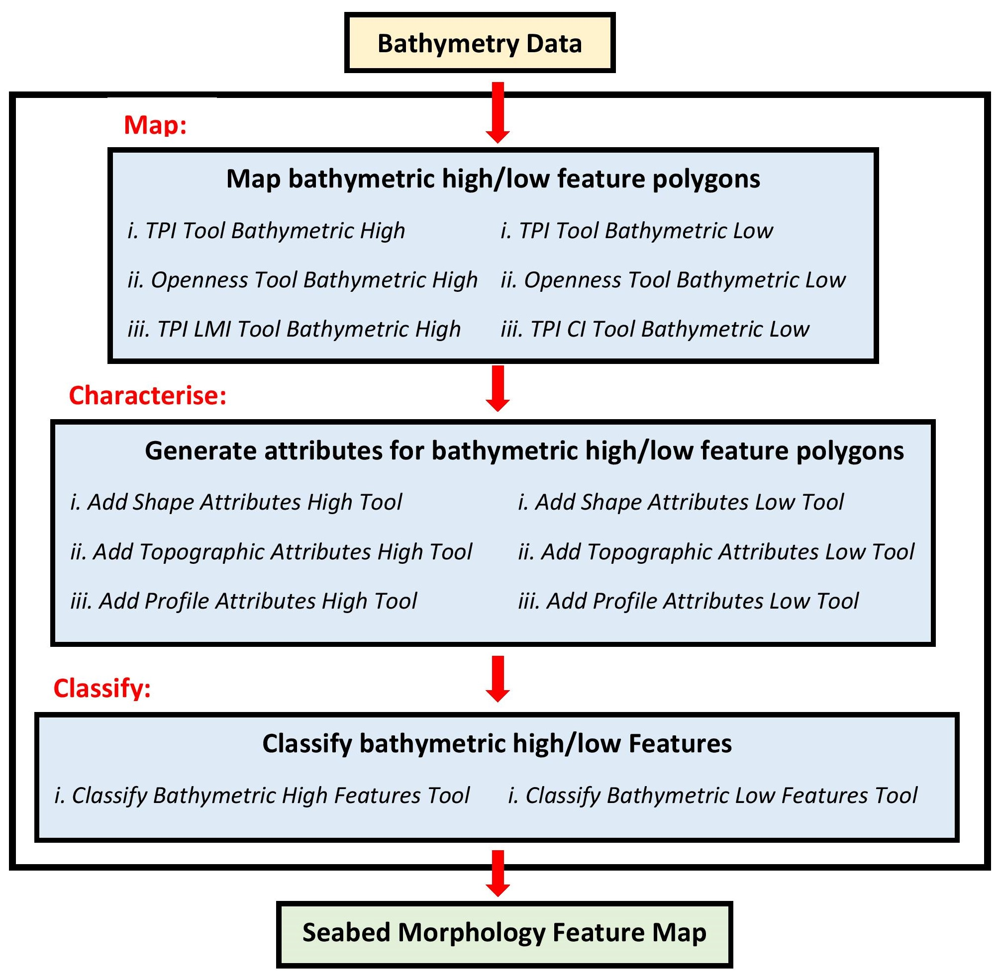

Overview
========

Geoscience Australia's Semi-automated Morphological Mapping Tools
-----------------------------------------------------------------

Seabed characterisation requires the measurement, description and classification of physical features on the seabed.
A key first step in this process is the identification of morphological forms, as derived from bathymetry data.
To facilitate rapid and consistent morphological mapping, Geoscience Australia has developed several semi-automated ArcGIS Python toolboxes that:

* Generate polygons from bathymetry surfaces that represent *bathymetric high* and *bathymetric low* seabed features
* Calculate metrics/attributes to describe the characteristics of the feature polygons
* Classify individual polygons into one of the bathymetric *high* or *low* seabed morphological feature types

The toolboxes adopt the suite of terms as presented in the glossary of seabed morphology features defined by :cite:`dove_2020_4075248`.

`Dove, D., Nanson, R., Bjarnadóttir, L., Guinan, J., Gafeira, J., Post, A., Dolan, M.; Stewart, H.; Arosio, R, Scott, G.. (2020). A two-part seabed geomorphology classification scheme (v.2); Part 1: morphology features glossary. Zenodo. <http://doi.org/10.5281/zenodo.4075248>`_.

The detailed description of the GA-SaMMT and its applications to serveral real-world case studies are presented in :cite:`huang_2023_1236788`.

`Huang Z, Nanson R, McNeil M, Wenderlich M, Gafeira J, Post A and Nichol S (2023) Rule-based semiautomated tools for
mapping seabed morphology from bathymetry data. Front. Mar. Sci. 10:1236788. doi: 10.3389/fmars.2023.1236788 <https://doi.org/10.3389/fmars.2023.1236788>`_.
