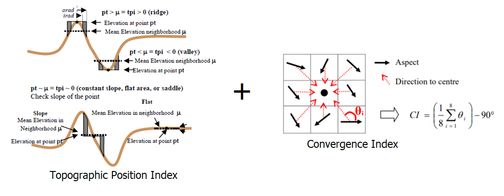

TPI CI Tool Bathymetric Low
---------------------------

This tool maps bathymetric low features from a bathymetric data using a combination of Topographic Position Index (TPI) :cite:`Weiss2001TopographicPA` and Convergence Index (CI) :cite:`Thommeret-hess-14-1527-2010` method.
Negative TPI usually indicates bathymetric low location.
Negative CI usually indicates location of convergence (or bathymetric low).

The followings are the key steps of this tool:

1. Calculate the Aspect raster from the input bathymetry raster
2. Calculate CI from the Aspect raster
3. Calculate TPI from the input bathymetry raster using the *TPI Circle Radius* parameter
4. Calculate the CI threshold using equation :eq:`ci-threshold-low`, where *c* is the *CI STD Scale* parameter, *mean_CI* and *STD_CI* are the mean and standard deviation statistics of the CI raster. The CI threshold should always have a negative value
5. Calculate the TPI threshold using equation :eq:`tpi-threshold`, where *c* is the *TPI STD Scale* parameter, *mean_TPI* and *STD_TPI* are the mean and standard deviation statistics of the TPI raster. The TPI threshold should always have a negative value
6. Select the first set of areas that have CI values smaller than the CI threshold
7. Select the second set of areas that have TPI values smaller than the TPI threshold
8. Mosaic the two sets of areas together to form a set of bathymetric low features
9. Remove the polygons with areas smaller than the *Area Threshold* parameter to obtain the final set of bathymetric low features as output

The TPI radius should be large enough to capture the largest bathymetric low features in the dataset.
For example, for a 5m resolution bathymetry raster, a radius of 50 cells should be used to capture any bathymetric  low features that is smaller than 500m in length.
Users should also experiment the *TPI STD Scale*, the *CI STD Scale* and the *Area Threshold* parameters to obtain an optimal output solution. 

