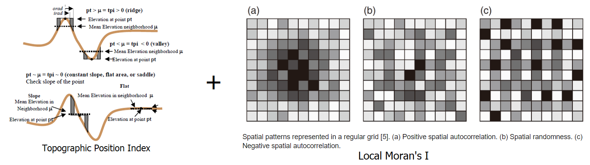

TPI LMI Tool Bathymetric High
-----------------------------

This tool maps bathymetric high features from a bathymetric data using a combination of Topographic Position Index (TPI) [Weiss2001]_ and Local Moran's I (LMI) [Moran1950]_ method.
Positive TPI usually indicates bathymetric high location. Positive LMI usually indicates a spatial pattern of positive (higher than average) local autocorrelation (e.g., in this case a similar local pattern of higher bathymetry values).

The followings are the key steps of this tool:

1. Calculate TPI from the input bathymetry raster using the *TPI Circle Radius* parameter
2. Calculate the TPI thresholds using this equation: TPI threshold = mean_TPI + c * STD_TPI, where c is the *TPI STD Scale Large* parameter or the *TPI STD Scale Small* parameter, mean_TPI and STD_TPI are the mean and standard deviation statistics of the TPI raster
3. Select the first set of areas that have TPI values greater than the *TPI STD Scale Large* threshold
4. Select the second set of areas that have TPI values greater than the *TPI STD Scale Small* threshol.
5. These two sets of areas and the bathymetry data are used together to select the 'core' areas of bathymetric high features, through GIS overlay and selection analyses
6. These 'core' areas are substracted from the bathymetry data
7. Calculate LMI from the substracted bathymetry raster using the *LMI Weight File* parameter
8. Calculate the LMI thresholds using this equation: LMI threshold = mean_LMI + c * STD_LMI, where c is the *LMI STD Scale* parameter , mean_LMI and STD_LMI are the mean and standard deviation statistics of the LMI raster
9. Select locations from the LMI raster that have LMI values greater than the LMI threshold. These locations (areas) are regarded as the remaining parts of bathymetric high features
10. Merge the 'core' areas and the 'remaining' parts of bathymetric high features to form individual bathymetric high features
11. Remove the feature polygons with areas smaller than the *Area Threshold* parameter to obtain the final set of bathymetric high features

The TPI radius should be large enough to capture the largest bathymetric high features in the dataset.
For example, for a 5m resolution bathymetry raster, a radius of 50 cells should be used to capture any bathymetric high features that is smaller than 500 m in length.
Users should also experiment the *TPI STD Scale Large*, the *TPI STD Scale Small*, the *LMI STD Scale* and the *Area Threshold* parameters to obtain an optimal output solution. 

.. [Moran1950] Moran, P.A.P., 1950. Notes on continuous stochastic phenomena, Biometrica, 37, 17-33.
.. [Weiss2001] Weiss, A.D. (2001). Topographic Position and Landforms Analysis. In, ESRI International User Conference. San Diego, CA

