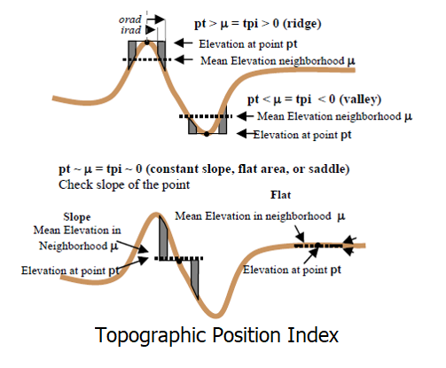

TPI Tool Bathymetric High
-------------------------

This tool maps bathymetric high features from a bathymetric data using a Topographic Position Index (TPI) :cite:`Weiss2001TopographicPA` based method.

Positive TPI usually indicates bathymetric high location.    

The followings are the key steps of this tool:

1. Calculate TPI from the input bathymetry raster using the *TPI Circle Radius* parameter
2. Calculate the TPI threshold using this equation: :math:`TPI\_threshold = mean\_TPI + c * STD\_TPI`, where c is the *TPI STD Scale* parameter, *mean_TPI* and *STD_TPI* are the mean and standard deviation statistics of the TPI raster
3. Select locations that have TPI values greater than the TPI threshold
4. Convert the selected areas into polygons
5. Remove the polygons with areas smaller than the *Area Threshold* parameter to obtain the final set of bathymetric high features as output

The TPI radius should be large enough to capture the largest bathymetric high features in the dataset.
For example, for a 5m resolution bathymetry raster, a radius of 50 cells should be used to capture any bathymetric high features that is smaller than 500 m in length.
Users should also experiment the *TPI STD Scale* and the *Area Threshold* parameters to obtain an optimal output solution. 

