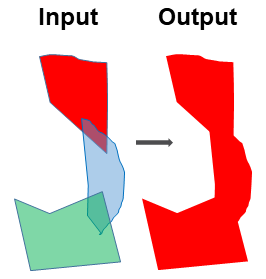

Update Feature Boundary
-----------------------

Two or multiple feature classes may have overlapped polygons.
This tool merges the overlapped polygons into one and update its boundary.

The followings are the steps:

1. Merge the input featureclasses using ArcGIS *Merge* tool . This stacks the polygons on top of each other without dissoving the boundaries
2. Add a *temporary* field to the merged *featureclass* and assign it a single value
3. Dissolve the merged featureclass using ArcGIS *Dissolve* tool, with the *temporary* field and the *SINGLE_PART* option

Note that this accessory tool is clearner than ArcGIS *Update* tool because the duplicates have been removed. In addition, this tool can update feature boundary for more than two input datasets.

.. code-block:: python
   :linenos:

   import arcpy
   from arcpy import env
   
   # import the python toolbox
   arcpy.ImportToolbox("C:/semi_automation_tools/User_Guide/Tools/Accessory_Tools.pyt")
   
   env.workspace = 'C:/semi_automation_tools/testSampleCode/Gifford.gdb'
   env.overwriteOutput = True
   
   # specify input and output parameters of the tool
   inFeats = 'test1;test2'
   dissolvedFeat = 'dissolvedFeat'
   
   
   # execute the tool with user-defined parameters
   arcpy.AccessoryTools.Update_Features_Tool(inFeats,dissolvedFeat)
